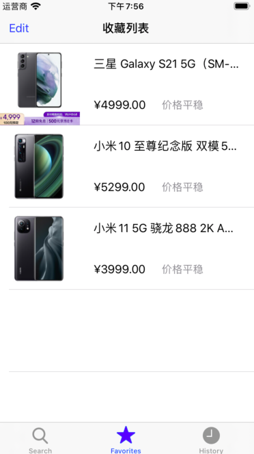

# 购物小助手

## 一、功能简介

一个简单的网购小助手，用户可以通过该应用在购物网站上检索商品，并且应用会通过对商品的评论进行情感分析生成推荐指数，用户还可以收藏感兴趣的商品观察其后期的价格变动方便之后以尽可能低的价格进行购买，取得实质性的优惠，并且该应用还可以搜索商品评测，当用户有想购买的商品的时候，可以先检索该商品相关的评测视频，然后决定是否进行购买。

## 二、使用说明

该应用程序需要网络连接，请在使用之前进行确认，进入应用程序之后，可以进行商品的检索，检索之后输入回车会进行商品检索，点击搜评测，会在b站检索搜索框搜索的内容并且进行呈现。

在搜索结果中，点击五角星可以收藏商品或者取消商品收藏，点击推荐指数的星星可以跳转到推荐详情：

推荐指数是通过对商品评论进行情感分析得出的，在推荐详情中呈现的是该商品的每条评论和对应的情感分析结果，由于有的评论比较长无法在一个单元格中进行展示，点击单元格之后可以查看评论更加详细的信息。

上述是收藏商品的界面，用户收藏的商品会在此处展示，并且点击左上角的edit可以删除已经收藏的商品，收藏商品具有持久化的效果，应用程序在重启之后仍然有效，当用户收藏的商品发生价格变化的时候此处会有提示。

在浏览记录中记录着应用自从上次启动之后用户浏览的商品，只有点击商品跳转到浏览器页面才算进行浏览。

## 二、代码介绍

* Controller：控制器相关

  * HistoryTableViewController：历史记录表格
  * ReviewTableViewController：用户评论表格
  * ReviewViewController：展示单条评论
  * SearchViewController：商品搜索页面
  * SubscribeTableViewController：收藏列表
  * WebViewVewController：浏览器界面

* model：模型相关

  * Item：商品
  * ItemManager：商品管理者，单例模式设计
  * Review：评论
  * SentimentClassifier.mlmodel：使用商品评论数据集训练的一个简单的情感分析模型
  * Utils：工具类

* View：视图相关

  * 各个表格的单元格类

  